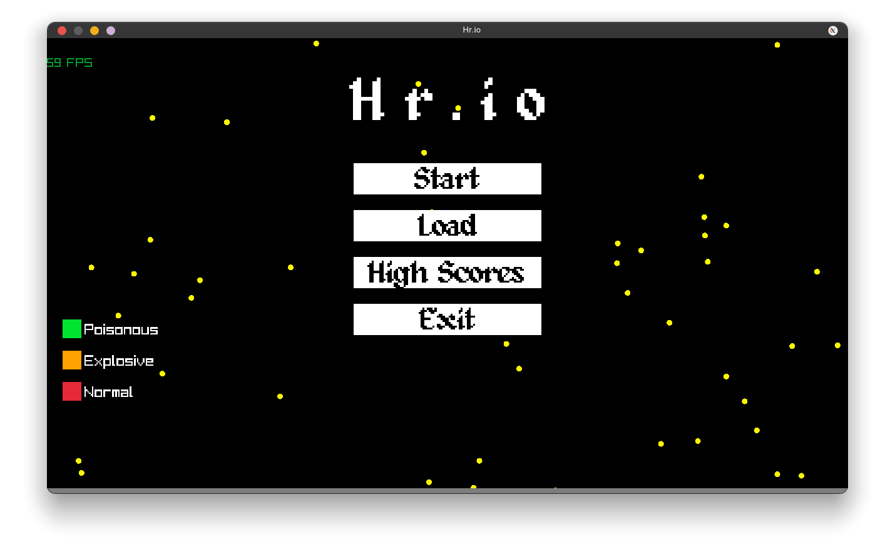

# Hr.io

*Bem vindo ao Hr.io! (lê-se "agario")*

Ao iniciar o jogo, a primeira tela apresentada é o menu principal.
Nele, haverão algumas opções disponíveis:

- Start: Inicia uma sessão de jogo. No início, perguntaremos o nome de seu personagem
    que deverá ser exibido ao longo da sessão (e mantido ao salvar seu jogo).
    Depois de inserir seu nome, o jogo irá começar. Você pode controlar seu personagem
    usando o mouse, já que a sua peça sempre segue o cursor. Ao longo do tabuleiro,
    haverão bolinhas rosas que podem ser comidas para aumentar a sua área. Também haverão
    bolinhas de outras cores, conforme indicadas na legenda do menu principal (mas cuidado,
    se fores menor que estas outras bolinhas, elas comerão você!). Seu objetivo é ficar
    a maior quantidade de tempo vivo, e se você se sair bem, quem sabe até colocar seu nome
    nos highscores do jogo.
    Você também pode pausar o jogo pressionando ESC, revelando algumas outras opções:

    - Continue: Sai da pausa e continua o seu jogo.

    - Save: Salva o seu jogo para que ele possa ser jogado mais tarde.

    - Exit: Sai da partida e volta ao menu principal.

- Load: Carrega o último jogo salvo.

- HighScores: Mostra as 10 melhores pontuações no jogo.

- Exit: Sai do jogo.

Jogo Por:
  - Eduardo A. Duarte (311408)
  - Pietro B. Carrara (318995)

Instruções de compilação:
  - Compile a raylib caso ela ainda não esteja compilada (`cd raylib/src; make`) (`mingw32-make` para windows)
  - Compile o Hr.io com os seguintes argumentos para o linker (linker settings no Code::Blocks)
    - Windows: `-Lraylib/src/ -lraylib -lopengl32 -lgdi32 -lwinmm`
    - Linux: `-lraylib -lGL -lm -lpthread -ldl -lrt -lX11`
  - :D
